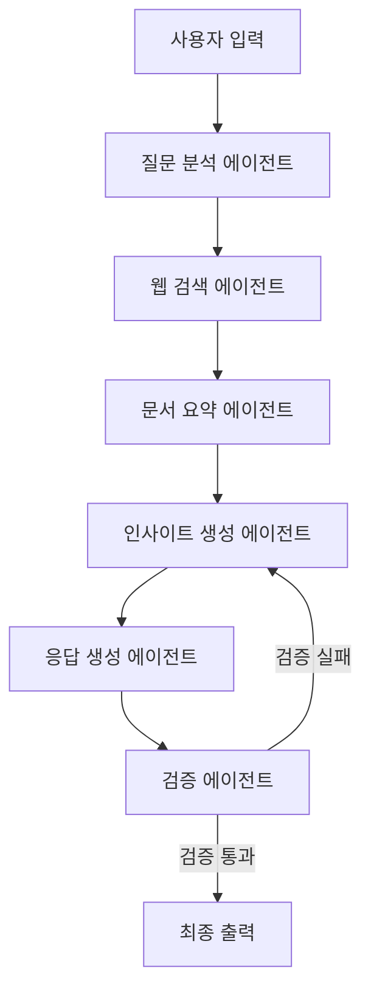

# 🔍 Deep Research Chatbot

LangChain, LangGraph, LangSmith 기반의 멀티 에이전트 시스템으로 사용자의 질문에 대해 다양한 관점에서 심층적으로 조사한 결과를 제공하는 딥 리서치 챗봇입니다.

## ✨ 주요 기능

### 🧠 지능형 질문 분석
- 사용자 입력을 분석하여 하위 질문(sub-queries) 자동 생성
- 다각도 관점에서 조사할 수 있도록 질문 확장

### 🌐 병렬 웹 검색
- **DuckDuckGo** + **Tavily** 검색 엔진 동시 활용
- 뉴스, 블로그, 리포트 등 다양한 소스에서 정보 수집
- 벡터 DB 기반 지능적 중복 제거

### 📚 문서 요약 및 인사이트 생성
- 수집된 문서들을 자동 요약
- 핵심 인사이트와 시사점 도출
- 마크다운 형식으로 구조화된 응답 생성

### ✅ 검증 및 품질 관리
- 응답 검증 에이전트를 통한 품질 관리
- 논리적 오류나 부정확성 자동 감지
- 필요시 재처리 루프 실행

### 🖥️ 직관적인 UI
- **Streamlit** 기반 심플한 인터페이스
- 실시간 진행 상태 표시
- 출처 포함된 신뢰도 높은 응답 제공

## 🛠️ 기술 스택

| 분야 | 기술 |
|------|------|
| **멀티 에이전트 프레임워크** | LangChain, LangGraph |
| **LLM** | GPT-4o / Gemini 2.0 Flash (선택 가능) |
| **검색 API** | DuckDuckGo, Tavily |
| **벡터 DB** | Chroma |
| **웹 인터페이스** | Streamlit |
| **모니터링** | LangSmith |

## 🚀 빠른 시작

### 1. 환경 설정

```bash
# 저장소 클론
git clone <repository-url>
cd deep_research_chatbot

# 가상환경 생성 및 활성화
python -m venv venv
source venv/bin/activate  # Windows: venv\Scripts\activate

# 의존성 설치
pip install -r requirements.txt
```

### 2. API 키 설정

`.env` 파일을 생성하고 필요한 API 키를 입력하세요:

```bash
# .env 파일 생성
cp .env.example .env
```

`.env` 파일에 다음 내용을 입력:

```env
# LLM 제공자 선택 (gpt 또는 gemini)
LLM_PROVIDER=gpt

# OpenAI API 키 (gpt 사용 시)
OPENAI_API_KEY=your_openai_api_key_here

# Google API 키 (gemini 사용 시)  
GOOGLE_API_KEY=your_google_api_key_here

# Tavily Search API 키
TAVILY_API_KEY=your_tavily_api_key_here

# LangSmith 모니터링 (선택사항)
LANGCHAIN_TRACING_V2=true
LANGCHAIN_API_KEY=your_langsmith_api_key_here
```

### 3. 애플리케이션 실행

```bash
streamlit run main.py
```

브라우저에서 `http://localhost:8501`로 접속하세요.

## 📋 사용 방법

1. **질문 입력**: 웹 인터페이스에서 조사하고 싶은 주제나 질문을 입력
2. **진행 상황 확인**: 각 에이전트의 처리 과정을 실시간으로 확인
3. **결과 확인**: 구조화된 마크다운 형식의 응답과 출처 정보 확인

### 💡 사용 예시

```
입력: "오픈소스 LLM 트렌드 알려줘"

출력:
## 오픈소스 LLM 트렌드

### 주요 모델들
- **Mistral 7B**: 높은 성능과 경량화로 주목받는 모델 *(출처: huggingface.co)*
- **LLaMA 2**: Meta에서 공개한 상업적 사용 가능한 모델 *(출처: arxiv.org)*

### 핵심 인사이트
- 기업들이 비용 절감을 위해 오픈소스 모델 도입 증가
- 상업용 모델과의 성능 격차가 빠르게 감소
```

## 🏗️ 프로젝트 구조

```
deep_research_chatbot/
├── main.py                     # Streamlit 앱 진입점
├── .env                        # 환경 변수 설정
├── 
├── agents/                     # 각 에이전트 구현
│   ├── question_analyzer.py    # 질문 분석 에이전트
│   ├── web_search.py           # 웹 검색 에이전트
│   ├── doc_summarizer.py       # 문서 요약 에이전트
│   ├── insight_generator.py    # 인사이트 생성 에이전트
│   ├── response_generator.py   # 응답 생성 에이전트
│   └── validator.py            # 검증 에이전트
├── 
├── config/                     # 설정 관련
├── models/                     # 데이터 모델
├── services/                   # 외부 서비스 인터페이스
├── workflows/                  # LangGraph 워크플로우
├── ui/                         # Streamlit UI 컴포넌트
└── utils/                      # 유틸리티 함수
```

## 🎯 멀티 에이전트 워크플로우



## 🔧 설정 옵션

### LLM 제공자 변경
`.env` 파일에서 `LLM_PROVIDER`를 변경:
- `gpt`: OpenAI GPT 모델 사용
- `gemini`: Google Gemini 모델 사용

### 검색 결과 조정
```env
MAX_SEARCH_RESULTS=20          # 최대 검색 결과 수
MAX_DOCUMENTS_TO_PROCESS=15    # 처리할 문서 수
MAX_VALIDATION_RETRIES=2       # 검증 재시도 횟수
```

## 📊 모니터링

LangSmith를 통해 각 에이전트의 성능과 처리 과정을 모니터링할 수 있습니다:

1. [LangSmith](https://smith.langchain.com/)에서 계정 생성
2. API 키를 `.env`에 추가
3. 대시보드에서 실시간 추적 확인

## 🧪 테스트

```bash
# 전체 테스트 실행
python -m pytest tests/

# 특정 테스트 실행
python -m pytest tests/test_agents.py
python -m pytest tests/test_workflow.py
```

## 🤝 기여하기

1. 이 저장소를 Fork
2. 새로운 기능 브랜치 생성 (`git checkout -b feature/amazing-feature`)
3. 변경사항 커밋 (`git commit -m 'Add amazing feature'`)
4. 브랜치에 Push (`git push origin feature/amazing-feature`)
5. Pull Request 생성

## 📄 라이선스

이 프로젝트는 MIT 라이선스 하에 배포됩니다. 자세한 내용은 `LICENSE` 파일을 참조하세요.

## 🆘 문제 해결

### 자주 발생하는 문제

**Q: API 키 오류가 발생해요**
- `.env` 파일이 올바른 위치에 있는지 확인
- API 키가 유효한지 확인
- 환경 변수 이름이 정확한지 확인

**Q: Streamlit이 실행되지 않아요**
- 가상환경이 활성화되어 있는지 확인
- 모든 의존성이 설치되어 있는지 확인: `pip install -r requirements.txt`

**Q: 검색 결과가 나오지 않아요**
- 인터넷 연결 상태 확인
- Tavily API 키가 유효한지 확인
- 방화벽 설정 확인

## 📞 지원

문제가 발생하거나 질문이 있으시면:
- GitHub Issues에 문제 보고
- 프로젝트 Wiki 문서 참조

---

**Deep Research Chatbot**으로 더 깊이 있는 정보 탐색을 시작해보세요! 🚀